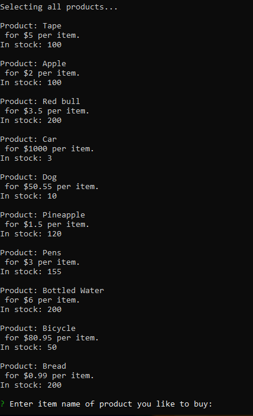
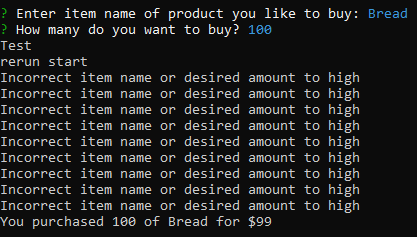

# MySQL-Bamazon
Bamazon CLI app 

Start by running node bamazon.js

User will be prompted to select item to buy. See below

Enter the desired product name
Then Enter the desired quantity of the product.

After the program will check each item to determine what product and amount was selected. 
